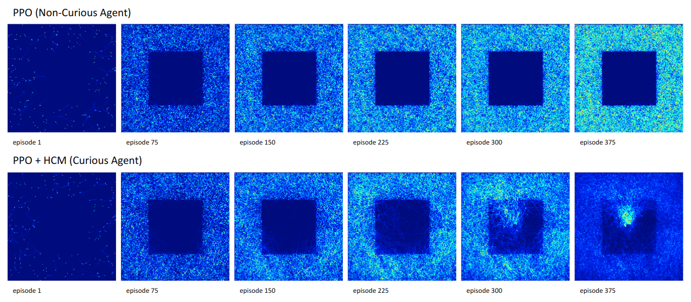
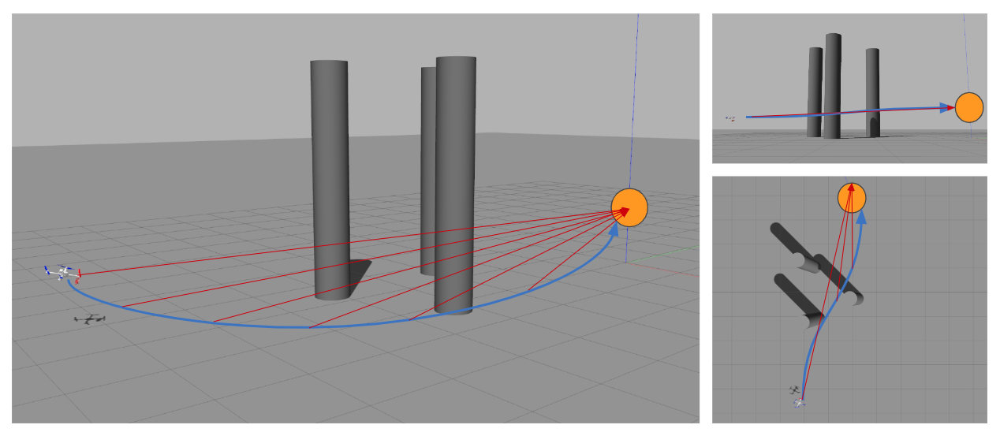
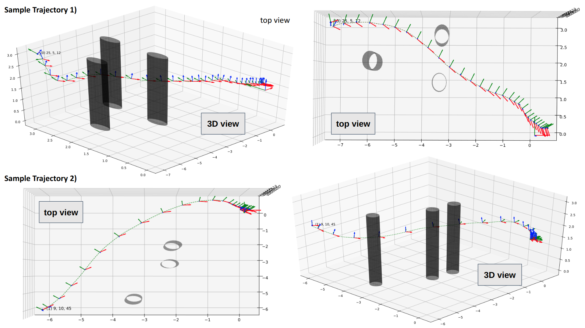

# Curiosity-Driven Reinforcement Learning based Low-Level Flight Control
This repository contains the code for the paper titled "Curiosity-Driven Reinforcement Learning based Low-Level Flight Control".
This package includes three different contibutions:
- **A curiosity module based on prediction error in trajectory of {states, actions, states, rewards} spaces called HCM (High-level Curiosity Module)**
- **A Curiosity-Driven Reinforcement Learning based Low-Level Flight Control that uses HCM and a modified version of PPO (Proximal Policy Optimization) to learn to fly and pass through the obstacles while controlling its Yaw toward desired position** 
- **A Gazebo based environment compatible with OpenAI Gym and Robot Operating System (ROS) for learning the low-level control of quad-copter. The environment includes obstacles that initiates in random positions, and measures the accuracy of Yaw control toward the desired position.**

# A low-level flight controller using High-level Curiousity Module (HCM) is capable of evolving its exploration pattern as illustrated in the following figure:
<p float="left">
  
</p>

# Reinforcement Learning:
Two capable reinforcement learning algorithm are used in this package, in a single fashion, and in combination with curiosity. Namely Proximal Policy Optimization (PPO), and Soft Actor Critic (SAC). The PPO algorithm (based on the stable-baseline PPO) is modified to match the necessities of low-level flight control. The SAC version is the default version provided by stable-baseline3.
To run the code install the following packages:
```
pip install stable-baseline # (https://github.com/openai/baselines)
pip install stable-baseline3 # (https://github.com/DLR-RM/stable-baselines3)
```

# Flight Environment:

<p float="left">
  
</p>
The environment developed in this package is called L2FC (Low-level Flight Control) and is compatible with gym.
including the following files:

```
├─ L2FC
|  ├─ L2FC_env.py
|  ├─ L2FC_sensors.py
|  ├─ L2FC_rewards.py
|  └─ L2FC_functions.py
```

To run the environment the following package needs to be installed first:

```
https://github.com/ethz-asl/rotors_simulator
```

Follow the instruction in the link and after successfully running the simulator using the following line of code:

```
roslaunch rotors_gazebo mav_with_obstacles.launch world_name:=new-empty mav_name:=hummingbird
```

Contrinue running the algorithms as mentioned in the following:

# Run the algorithms:

For running PPO+HCM use python3.6 and tensorflow 1.4
```
python CDRL_L2FC_run.py PPO
python CDRL_L2FC_run.py PPO_ICM
python CDRL_L2FC_run.py PPO_HCM
```

For running SAC use python 3.8 and tensorflow 2.4 and pytorch 1.12
```
python3.8 CDRL_L2FC_run_SAC_sb3.py
```

# Parameters
The parameters defined in the package can be divided in three parts
- **Reinforcement Learning Parameters**
- **Curiosity Parameters** 
- **Flight Environment Parameters** 

And can be changed in CL2FC_parameters.py, environment and the reinforcement learning and curiosity modules automatically use the parameters defined in that file.
<p float="left">
  
</p>

